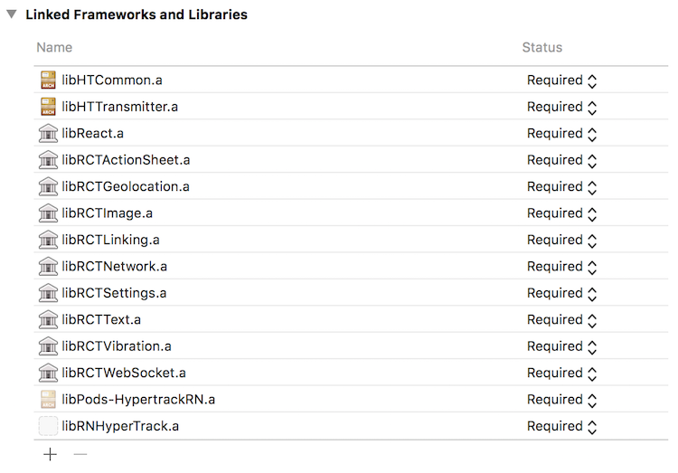

# react-native-hypertrack
React native module for hypertrack-android and hypertrack-ios SDKs. Methods in the Driver SDK are covered in the current release. The [example-react-native](https://github.com/hypertrack/example-react-native) app is built on top of this module.

[](http://slack.hypertrack.io) [](https://badge.fury.io/js/react-native-hypertrack)

## Getting started
In your project directory, install and link the module package from npm.
```
$ npm install react-native-hypertrack --save
$ react-native link react-native-hypertrack
```

If you are using an older version of React Native that does not support `link`, you can [manually link](https://facebook.github.io/react-native/docs/linking-libraries-ios.html) libraries.

### Android setup
1. To use the HyperTrack Android SDKs, the following urls need to be added to your `android/build.gradle` file. This will configure the repository urls for the SDKs.

        ```
        allprojects {
            repositories {
                ...
                maven { url 'http://hypertrack-android-sdk.s3-website-us-west-2.amazonaws.com/' }
                maven { url 'https://repo.eclipse.org/content/repositories/paho-releases/' }
            }
        }
        ```

2. Include this module in your `android/settings.gradle`:

    ```
    include ':react-native-hypertrack'
    project(':react-native-hypertrack').projectDir = new File(rootProject.projectDir, '../node_modules/react-native-hypertrack/android')
    include ':app'
    ```

3. Add a dependency to your app build in `android/app/build.gradle`:

    ```
    dependencies {
       ...
       compile project(':react-native-hypertrack')
    }
    ```

4. Change your main application to add a new package, in `android/app/src/main/.../MainApplication.java`:

    ```java
    import com.reactlibrary.RNHyperTrackPackage; // Add new import

    public class MainApplication extends Application implements ReactApplication {
      ...

      @Override
      protected List<ReactPackage> getPackages() {
        return Arrays.<ReactPackage>asList(
          new MainReactPackage(),
          new RNHyperTrackPackage() // Add the package here
        );
      }
    }
    ```

### iOS setup
1. The native iOS SDKs need to be setup using Cocoapods. In your project's `ios` directory, create a Podfile.
    ```
    $ cd ios
    $ pod init
    ```

2. Edit the Podfile to include `HTTransmitter` as a dependency for your project, and then install the pod.
    ```
    $ cat Podfile
    target 'YourApp' do
      pod 'HTTransmitter'
    end

    $ pod install
    ```

3. Now, open the iOS project with the `.xcworkspace` file in Xcode, and add the native SDK `.a` files in the linked frameworks and libraries section. You need to add *libHTTransmitter.a*, *libHTCommon.a*, *libMQTTClient.a*.


## Usage

#### Import and initialize SDK with your Publishable key before making any other API call
 
```javascript
 import RNHyperTrack from 'react-native-hypertrack';
 ...

 export default class MyApp extends Component {
   constructor() {
     super();
     // Initialize HyperTrack wrapper
     RNHyperTrack.initialize(config.HT_PUBLISHABLE_KEY);
   }
 }
  ...
```
#### Starting a Trip
```javascript
 RNHyperTrack.startTrip(
   DRIVER_ID,
   [TASK_ID_1, TASK_ID_2...],
   (successValue) => {
     // Handle Success
   },
   (error) => {
     // Handle error
   }
 );
```
#### Completing a task

```javascript
 RNHyperTrack.completeTask(
   TASK_ID,
   (successValue) => {
      // Handle Success
   },
   (error) => {
     // Handle error
   }
 );
```
    
#### Ending a trip
```javascript
 RNHyperTrack.endTrip(
   TRIP_ID,
   (successValue) => {
     // Handle success
   },
   (error) => {
     // Handle error
   }      
 );
```
## Documentation
The HyperTrack documentation is at [docs.hypertrack.io](http://docs.hypertrack.io/).

## Support
For any questions, please reach out to us on [Slack](http://docs.hypertrack.io/) or on help@hypertrack.io. Please create an [issue](https://github.com/hypertrack/hypertrack-cordova/issues) for bugs or feature requests.

## Acknowledgements
Thanks to [react-native-create-library](https://github.com/frostney/react-native-create-library) which saved a few hours.
